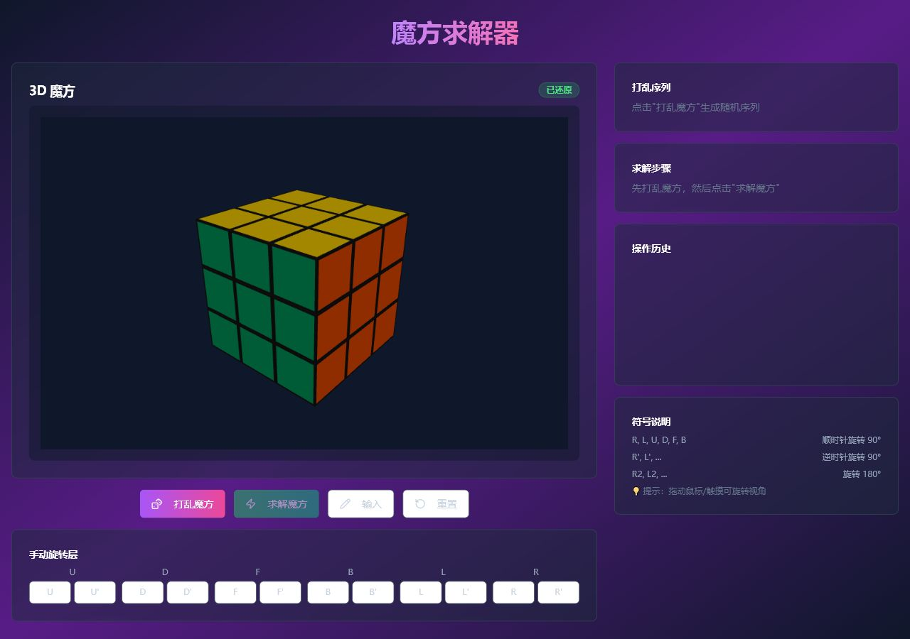

# 魔方求解器

一个可以直接在浏览器里使用的 3D 魔方求解器。支持二维展开图输入颜色、随机打乱、手动旋转、Kociemba 自动求解、逐步执行解法，并且可以在手机上作为 PWA 添加到主屏幕。

## 在线体验

[打开魔方求解器](https://1708293266.github.io/cube---solver/)

> 手机和电脑都可以直接打开使用。手机浏览器可通过“添加到主屏幕”把它当作应用启动。

## 项目预览

## 功能亮点

- 3D 魔方实时渲染，支持鼠标和触摸拖动视角
- 二维展开图输入魔方颜色，适合从真实魔方录入状态
- Kociemba 算法自动求解复杂局面
- 简单局面优先搜索短解，减少多余步骤
- 支持随机打乱、操作历史、逐步执行和一键执行
- 支持 GitHub Pages HTTPS 部署和 PWA 离线缓存
- 纯前端运行，不需要后端服务

## 使用方式

1. 打开在线体验网址。
2. 点击“输入”，按二维展开图录入六个面的颜色。
3. 点击“求解魔方”生成步骤。
4. 使用“下一步”逐步观察还原过程，或点击“全部执行”自动还原。

## 技术栈

- React
- TypeScript
- Vite
- Three.js
- Tailwind CSS
- cubejs
- GitHub Actions
- GitHub Pages

## English

A browser-based 3D Rubik cube solver built with React, Three.js and the Kociemba algorithm. It supports 2D cube-net color input, random scrambles, step-by-step solving, mobile browsers and PWA installation.

Live demo: [https://1708293266.github.io/cube---solver/](https://1708293266.github.io/cube---solver/)

## 开源协议

MIT
